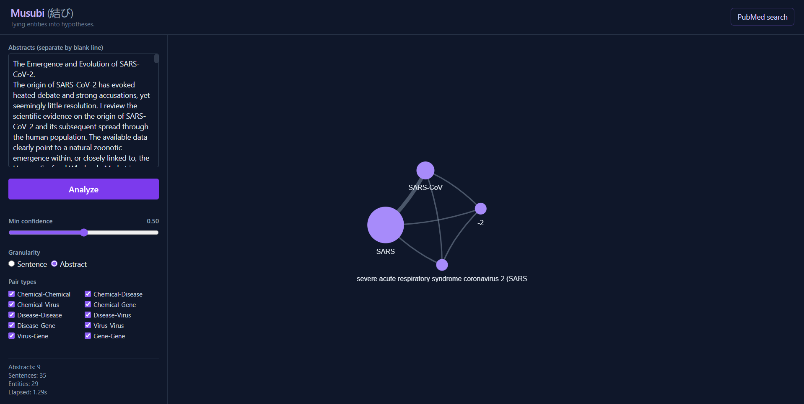

<!-- ---
title: Musubi (結び)
emoji: 🧬
colorFrom: indigo
colorTo: purple
sdk: docker
app_port: 7860
pinned: false
license: mit
short_description: Visualize entity relationship from PubMed abstracts.
--- -->

<div align="center">

# Musubi (結び)

Extract biomedical entities from PubMed abstracts and map their co-mentions as an interactive graph.

[](https://www.python.org/)
[](https://fastapi.tiangolo.com/)
[](https://pytorch.org/)
[](Dockerfile)
[](LICENSE)

[**Live demo**](https://lumicero-musubi.hf.space/) · [Report an issue](https://github.com/luminolous/musubi/issues)

<br />



</div>

---

## About

Musubi runs biomedical named entity recognition on PubMed abstracts and draws a graph where each edge is a sentence in which two entities appear together. It is built around virus-centric drug repurposing: a Virus-Chemical edge might point to a candidate drug, a Virus-Gene edge to a molecular target, a Chemical-Disease edge to a known or speculative indication.

Co-mention is not causal evidence. Two entities in the same sentence may have nothing to do with each other. The graph is a filter, not a conclusion. Every edge links back to the original sentence so you can read the wording before deciding whether the pair is worth following up.

The model is [`lumicero/Joint-Uniform-BioNER`](https://huggingface.co/lumicero/Joint-Uniform-BioNER), a PubMedBERT token classifier trained on a merged corpus of BC5CDR, NCBI Disease, BC2GM, and a curated virus dataset.

## Features

- Named entity recognition across four types: Chemical, Disease, Virus, and Gene.
- Sentence-level or abstract-level co-mention aggregation, with a confidence threshold slider that re-runs inference on release.
- Force-directed graph via vis-network. Node size scales with mention count; edge thickness scales with co-mention frequency. Click a node to dim everything outside its neighborhood; click an edge to read the source sentences with entity spans highlighted.
- PubMed search via NCBI Entrez. Enter a query, choose a result count, and the abstracts load directly into the input area.
- Entity normalization that groups surface variants under a shared key and displays the most frequent form as the node label.
- Pair-type filter (Chemical-Disease, Gene-Virus, etc.) that updates the graph without re-running inference.

## Tech stack

| Layer | Choice | Why |
|-------|--------|-----|
| Frontend | HTML, Tailwind CSS CDN, vis-network CDN, vanilla JS | No build step. A single HTML file with two CDN script tags. |
| Backend | FastAPI, uvicorn | Clean request validation with pydantic, minimal setup. |
| NER | transformers + PyTorch (CPU) | PubMedBERT token classifier loaded directly from Hugging Face Hub. |
| Sentence splitting | pysbd | More reliable on biomedical abbreviations than basic regex. |
| PubMed | biopython Entrez | Covers esearch and efetch without needing a raw HTTP client. |
| Deploy | Docker, Hugging Face Space (CPU basic) | Free tier with the model cache persisting between requests. |

## Project layout

```
app.py              FastAPI entry point, all routes
src/
  ner.py            model loading, batched inference, BIO span decoding
  pipeline.py       sentence splitting and co-mention aggregation
  normalize.py      entity key normalization and display label selection
  entrez.py         PubMed fetch via biopython Entrez
  schemas.py        pydantic v2 request and response models
static/
  index.html        single-page app
  style.css         dark theme, entity highlight colors
  app.js            graph rendering, evidence panel, PubMed modal
Dockerfile
requirements.txt
```

## Limitations

Co-mention is not causation. Two entities in the same sentence may appear together only to say they are unrelated, or the sentence may describe a negative result. Read the evidence behind each edge before drawing conclusions.

Inference runs on a free CPU tier (2 vCPU). Expect roughly 0.3 seconds per sentence. The app rejects requests that exceed 50 abstracts or 500 sentences.

Entity normalization uses a simple lowercase-and-strip key. There is no linking to external ontologies like MeSH, NCBI Taxonomy, or HGNC, so two names for the same entity that produce different keys will appear as separate nodes.

The model is conservative on some complex surface forms. It may tag only part of a multi-token name. Lowering the confidence slider widens recall at the cost of precision.

## Acknowledgments

- Model: [`lumicero/Joint-Uniform-BioNER`](https://huggingface.co/lumicero/Joint-Uniform-BioNER)
- Training data: BC5CDR, NCBI Disease, BC2GM, curated virus corpus from PubMed
- Literature source: PubMed via [NCBI Entrez](https://www.ncbi.nlm.nih.gov/books/NBK25501/)
- Sentence splitter: [pysbd](https://github.com/nipunsadvilkar/pySBD)
- Graph rendering: [vis-network](https://visjs.org/)

## License

Released under the MIT license. See [LICENSE](LICENSE).
